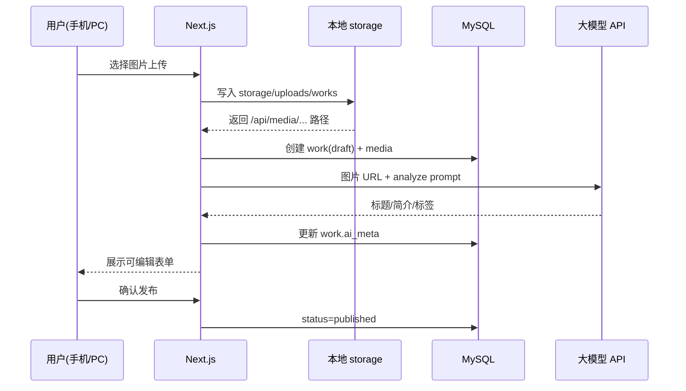
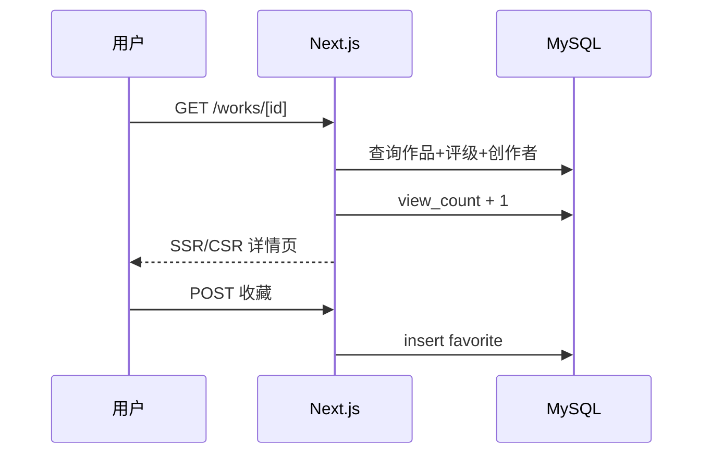

# 架构总览（验证期）

> 艺术家个人资产体系 · Next.js 全栈单体

## 1. 架构形态

**验证期采用：Next.js 全栈单体 + 响应式 Web**

```
┌──────────────────────────────────────────┐
│           Next.js 单应用                   │
│  ┌──────────────┐    ┌─────────────────┐ │
│  │ 页面 (RSC/   │    │ API Routes      │ │
│  │ Client)      │    │ /app/api/*      │ │
│  │ PC + 手机    │    │ Server Actions  │ │
│  └──────────────┘    └────────┬────────┘ │
└───────────────────────────────┼──────────┘
                                │
          ┌─────────────────────┼─────────────────────┐
          ▼                     ▼                     ▼
    MySQL 8.4             本地图片存储              大模型 API
    (D:\DevTools)    storage/uploads (D盘项目内)      (HTTP)
```

不部署独立后端服务、不使用 Redis/队列。数据库为**本地 MySQL**，不用云 PostgreSQL。

---

## 2. 请求链路示例

### 2.1 上传作品 + AI 分析



### 2.2 浏览与收藏



---

## 3. 多端架构

| 层级 | 实现 |
|------|------|
| 交付形态 | 响应式 Web（同一域名） |
| 布局 | Mobile First Tailwind |
| 手机导航 | 底部 Tab：首页 / 发现 / 上传 / 我的 |
| PC 导航 | 顶部 Header + 多列内容区 |
| 增强 | PWA manifest（可选） |
| 不做 | 小程序、原生 App、独立 m 站 |

详见 [decisions/002-responsive-web.md](../decisions/002-responsive-web.md)。

---

## 4. 模块划分（代码层）

验证期在 `app/` 与 `lib/` 内按领域组织，逻辑单体：

| 模块 | 路径 | 职责 |
|------|------|------|
| 认证 | `lib/auth.ts`, `app/api/auth/` | 登录、Session/JWT |
| 用户/创作者 | `app/api/creators/` | 资料 CRUD |
| 作品 | `app/api/works/` | 作品 CRUD、列表 |
| 媒体 | `lib/storage.ts` | 本地磁盘读写 + `/api/media` 输出 |
| AI | `lib/ai.ts`, `app/api/ai/` | V-AI-01/02 |
| 评级 | `app/api/ratings/`, `app/admin/` | Admin 评级 |
| 收藏 | `app/api/favorites/` | 收藏 |
| 意向 | `app/api/intents/` | 合作意向 |
| 管理 | `app/admin/*` | 后台页面 |

---

## 5. 部署架构

### 方案 A：本机开发 + 局域网试运行（当前推荐）

```
手机/PC → http://本机IP:3000 (Next.js dev 或 build)
              → 127.0.0.1:3306 本地 MySQL
              → storage/uploads（本地）
              → LLM API
```

### 方案 B：D 盘云主机（正式试运行）

```
用户 → Nginx → Next.js
            → 同机 MySQL + 本地 storage/uploads
            → LLM API
```

---

## 6. 安全要点

- 所有 `/admin/*` 与写操作 API 需鉴权  
- 上传：MIME 白名单（image/jpeg, image/png, image/webp）  
- AI 调用：服务端发起，API Key 不入前端  
- 合作意向联系方式：详情页不公开他人手机号  

---

## 7. 相关文档

- [架构演进](./evolution.md)
- [ADR-001 架构选型](../decisions/001-architecture.md)
- [ADR-002 多端方案](../decisions/002-responsive-web.md)
- [验证期数据模型](../database/validation-schema.md)
